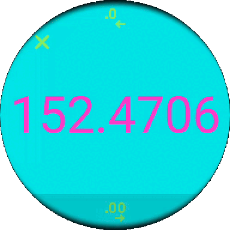

<h1 align="center">
   
  Rule Of 3
</h1>

  <strong>Calculate the famous rule of three in your wrist!</strong> 
  This tiny wearOS app lets you use the <a href="https://en.wikipedia.org/wiki/Cross-multiplication#Rule_of_three">rule of three</a> to calculate how the 4th number will be by inputing the prior 3 numbers

- [Use Cases](#use-cases)
  - [Calculating the 4th number](#calculating-the-4th-number)
  - [Seeing the Result](#seeing-the-result-diaglog)
  - [Seeing the History](#seeing-the-history)
- [Technologies](#technologies)
- [Challenges](#challenges)
- [Diagrams](#diagrams)
  -[Package `io.schiar.ruleofthree`](#package-ioschiarruleofthree)

## Use Cases

### Calculating the 4th number
|&nbsp;&nbsp;&nbsp;&nbsp;&nbsp;&nbsp;&nbsp;&nbsp;&nbsp;&nbsp;&nbsp;&nbsp;&nbsp;&nbsp;&nbsp;&nbsp;&nbsp;&nbsp;&nbsp;&nbsp;&nbsp;&nbsp;&nbsp;&nbsp;&nbsp;&nbsp;&nbsp;&nbsp;&nbsp;&nbsp;&nbsp;&nbsp;&nbsp;&nbsp;&nbsp;&nbsp;&nbsp;&nbsp;&nbsp;&nbsp;Screenshot&nbsp;&nbsp;&nbsp;&nbsp;&nbsp;&nbsp;&nbsp;&nbsp;&nbsp;&nbsp;&nbsp;&nbsp;&nbsp;&nbsp;&nbsp;&nbsp;&nbsp;&nbsp;&nbsp;&nbsp;&nbsp;&nbsp;&nbsp;&nbsp;&nbsp;&nbsp;&nbsp;&nbsp;&nbsp;&nbsp;&nbsp;&nbsp;&nbsp;&nbsp;&nbsp;&nbsp;&nbsp;&nbsp;&nbsp;&nbsp;|Description|
|:-:|:-:|
||This is how the app looks like when you open it. To add the numbers click on the squares|
||You can change the unknown position anytime by long clicking on the input you want to change to the unknown|
||When you click on the square the input number appear. You can input any number, backspace, or clear it and then click on the most right button to submit| 
||When the numbers are being input you can start over by clicking on bottom icon to erase all inputs|
||Imagine you are cooking rice, and you saw on the nutritional table that to make 45g of raw rice is 160kcal, and you wonder how many calories would be if you cook 62g of rice. You can input "45" and "160" on the first and second square, and then you can input "62" on the third square. The Result will appear right where the "?" is|

### Seeing the Result Diaglog
|&nbsp;&nbsp;&nbsp;&nbsp;&nbsp;&nbsp;&nbsp;&nbsp;&nbsp;&nbsp;&nbsp;&nbsp;&nbsp;&nbsp;&nbsp;&nbsp;&nbsp;&nbsp;&nbsp;&nbsp;&nbsp;&nbsp;&nbsp;&nbsp;&nbsp;&nbsp;&nbsp;&nbsp;&nbsp;&nbsp;&nbsp;&nbsp;&nbsp;&nbsp;&nbsp;&nbsp;&nbsp;&nbsp;&nbsp;&nbsp;Screenshot&nbsp;&nbsp;&nbsp;&nbsp;&nbsp;&nbsp;&nbsp;&nbsp;&nbsp;&nbsp;&nbsp;&nbsp;&nbsp;&nbsp;&nbsp;&nbsp;&nbsp;&nbsp;&nbsp;&nbsp;&nbsp;&nbsp;&nbsp;&nbsp;&nbsp;&nbsp;&nbsp;&nbsp;&nbsp;&nbsp;&nbsp;&nbsp;&nbsp;&nbsp;&nbsp;&nbsp;&nbsp;&nbsp;&nbsp;&nbsp;|Description|
|:-:|:-:|
||When you click on the results you can see the number bigger on a dialog. You can increase the precision by clicking on the bottom icon. You can also decrease once you increase it by clicking on the upper icon. If the options are not appearing that means the number is at its maximum precision|

### Seeing the History
|&nbsp;&nbsp;&nbsp;&nbsp;&nbsp;&nbsp;&nbsp;&nbsp;&nbsp;&nbsp;&nbsp;&nbsp;&nbsp;&nbsp;&nbsp;&nbsp;&nbsp;&nbsp;&nbsp;&nbsp;&nbsp;&nbsp;&nbsp;&nbsp;&nbsp;&nbsp;&nbsp;&nbsp;&nbsp;&nbsp;&nbsp;&nbsp;&nbsp;&nbsp;&nbsp;&nbsp;&nbsp;&nbsp;&nbsp;&nbsp;Screenshot&nbsp;&nbsp;&nbsp;&nbsp;&nbsp;&nbsp;&nbsp;&nbsp;&nbsp;&nbsp;&nbsp;&nbsp;&nbsp;&nbsp;&nbsp;&nbsp;&nbsp;&nbsp;&nbsp;&nbsp;&nbsp;&nbsp;&nbsp;&nbsp;&nbsp;&nbsp;&nbsp;&nbsp;&nbsp;&nbsp;&nbsp;&nbsp;&nbsp;&nbsp;&nbsp;&nbsp;&nbsp;&nbsp;&nbsp;&nbsp;|Description|
|:-:|:-:|
||Once you've done at least one calculation, the history button will appear at the center right letting you to see all the calculations you've done. You can edit the inputs by pressing it just like the on the cross multiplication screen, delete the calculation by clicking on the right icon, go back to the cross multiplication screen by clicking on icon on the left, or delete all of them by clicking on the top icon|

# Technologies
|Technology|Purpose|
|:-:|:-:|
| [Jetpack Compose](https://developer.android.com/jetpack/compose)|Designing UI|
| [Room](https://developer.android.com/jetpack/androidx/releases/room)|Persistence of History and Current Cross Multipliers|
| [IconCreator](https://github.com/giovanischiar/icon-creator)|My own library that generate the application icon|

## Challenges
  - Not any particular challenge on creating this app. Although it's a very simple app, it was interesting to create a wearOS app;

## Diagrams
### Package `io.schiar.ruleofthree`
<picture>
  <source media="(prefers-color-scheme: dark)" srcset="./readme-res/diagrams/dark/io-schiar-ruleofthree-structure-diagram.dark.svg">
  
</picture>