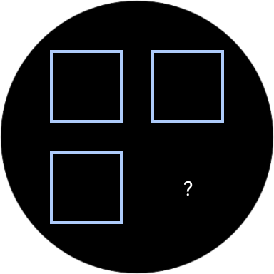
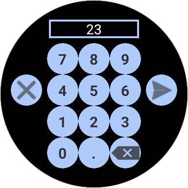
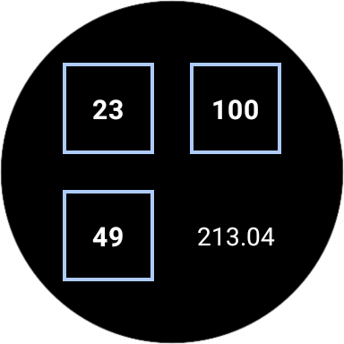

<h1 align="center">
   
  Rule Of 3
</h1>

  <strong>Calculate the famous rule of three in your wrist!</strong> 
  This tiny wearOS app lets you use the <a href="https://en.wikipedia.org/wiki/Cross-multiplication#Rule_of_three">Rule of Three</a> to calculate how the 4th number will be by inputing the prior 3 numbers

- [Use Cases](#use-cases)
  - [Calculate the 4th number](#calculate-the-4th-number)
- [Technologies](#technologies)
- [Challenges](#challenges)

## Use Cases

### Calculate the 4th number
|Screenshot|Description|
|:-:|:-:|
||This is how the app looks like when you open it. To add the numbers click on the squares|
||When you click on any of the squares, the number pad will appear letting you input the number. You can click on the digits, submit by clicking on the button on the right, or delete entirely by clicking on the button on the right. 
||When all numbers were added, the result will appear at the bottom left where the "?" was

# Technologies
|Technology|Purpose|
|:-:|:-:|
| [Jetpack Compose](https://developer.android.com/jetpack/compose)|Designing UI|

## Challenges
  - Not any particular challenge on creating this app. Altough it's a very simple app, it was interesting to create a wearOS app;
