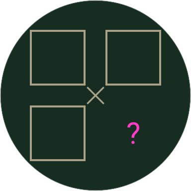
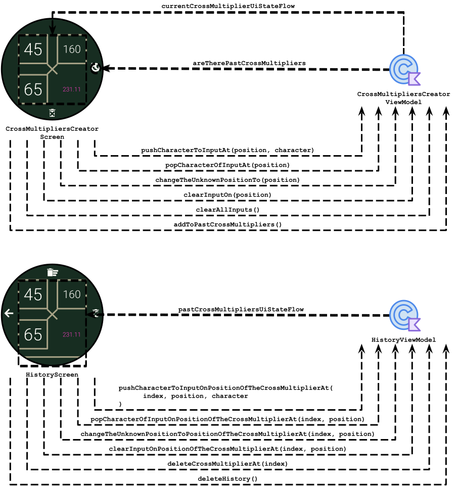
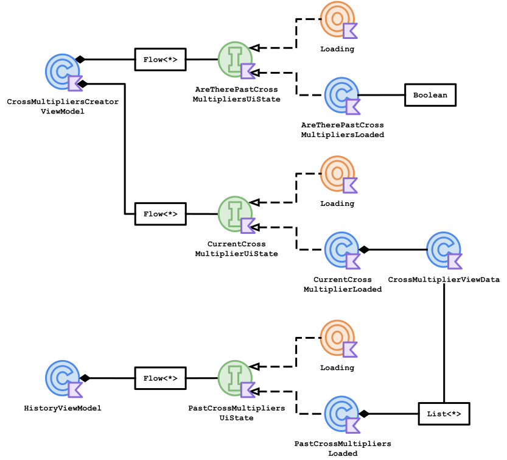

<h1 align="center">
   
  Rule Of 3
</h1>

  <strong>Calculate the famous rule of three in your wrist!</strong> 
  This tiny WearOS app allows you to use the <a href="https://en.wikipedia.org/wiki/Cross-multiplication#Rule_of_three">rule of three</a> to calculate the fourth number by inputting the prior three numbers.

- [Tests](#tests)
- [Use Cases](#use-cases)
  - [Calculating the Result](#calculating-the-result)
  - [Seeing the Result](#seeing-the-result-diaglog)
  - [Seeing the History](#seeing-the-history)
- [Technologies](#technologies)
- [Challenges](#challenges)
- [Diagrams](#diagrams)
  - [Package `io.schiar.ruleofthree`](#package-ioschiarruleofthree)
  - [Package `view` and `viewmodel`](#package-view-and-viewmodel)
  - [Package `viewmodel.viewdata`](#package-viewmodelviewdata)
  - [Package `viewmodel` and `viewmodel.viewdata`](#package-viewmodel-and-viewmodelviewdata)
  - [Package `viewmodel` and `model.repository`](#package-viewmodel-and-modelrepository)
  - [Package `model`](#package-model)
  - [Package `model.repository` and `model`](#package-modelrepository-and-model)
  - [Package `model.repository`, `model.datasource`, `model.datasource.local`, and `library.room`](#package-modelrepository-modeldatasource-modeldatasourcelocal-and-libraryroom)
- [Future Tasks](#future-tasks)

## Tests
  I created tests that cover 100% of the `model` and `viewmodel` packages. You can click on the image below to see the full test report generated by Gradle:
  

## Use Cases

### Calculating the Result
|&nbsp;&nbsp;&nbsp;&nbsp;&nbsp;&nbsp;&nbsp;&nbsp;&nbsp;&nbsp;&nbsp;&nbsp;&nbsp;&nbsp;&nbsp;&nbsp;&nbsp;&nbsp;&nbsp;&nbsp;&nbsp;&nbsp;&nbsp;&nbsp;&nbsp;&nbsp;&nbsp;&nbsp;&nbsp;&nbsp;&nbsp;&nbsp;&nbsp;&nbsp;&nbsp;&nbsp;&nbsp;&nbsp;&nbsp;&nbsp;Screenshot&nbsp;&nbsp;&nbsp;&nbsp;&nbsp;&nbsp;&nbsp;&nbsp;&nbsp;&nbsp;&nbsp;&nbsp;&nbsp;&nbsp;&nbsp;&nbsp;&nbsp;&nbsp;&nbsp;&nbsp;&nbsp;&nbsp;&nbsp;&nbsp;&nbsp;&nbsp;&nbsp;&nbsp;&nbsp;&nbsp;&nbsp;&nbsp;&nbsp;&nbsp;&nbsp;&nbsp;&nbsp;&nbsp;&nbsp;&nbsp;|&nbsp;&nbsp;&nbsp;&nbsp;&nbsp;&nbsp;&nbsp;&nbsp;&nbsp;&nbsp;&nbsp;&nbsp;&nbsp;&nbsp;&nbsp;&nbsp;&nbsp;&nbsp;&nbsp;&nbsp;Description&nbsp;&nbsp;&nbsp;&nbsp;&nbsp;&nbsp;&nbsp;&nbsp;&nbsp;&nbsp;&nbsp;&nbsp;&nbsp;&nbsp;&nbsp;&nbsp;&nbsp;&nbsp;&nbsp;&nbsp;|
|:-:|:-:|
||This is what the app looks like when you open it. To add the numbers, press on the squares called inputs.|
||You can change the unknown position anytime by long-pressing on the input you want to change to the unknown|
||When you press on the square, the input number appears. You can input any number, use the backspace, or clear it, and then press on the rightmost button to submit.| 
||When the numbers are being input, you can start over by pressing on the bottom icon to erase all inputs.|
||Imagine you are cooking rice. You see on the nutritional table that 45g of raw rice is 160kcal, and you wonder how many grams would be needed to get 200 calories of rice. You can input "45" and "160" into the first and second inputs, then you can change the unknown position by long-pressing the input on the bottom left, and type "200" into the input on the bottom right. The result will appear right where the "?" is.|

### Seeing the Result Dialog
|&nbsp;&nbsp;&nbsp;&nbsp;&nbsp;&nbsp;&nbsp;&nbsp;&nbsp;&nbsp;&nbsp;&nbsp;&nbsp;&nbsp;&nbsp;&nbsp;&nbsp;&nbsp;&nbsp;&nbsp;&nbsp;&nbsp;&nbsp;&nbsp;&nbsp;&nbsp;&nbsp;&nbsp;&nbsp;&nbsp;&nbsp;&nbsp;&nbsp;&nbsp;&nbsp;&nbsp;&nbsp;&nbsp;&nbsp;&nbsp;Screenshot&nbsp;&nbsp;&nbsp;&nbsp;&nbsp;&nbsp;&nbsp;&nbsp;&nbsp;&nbsp;&nbsp;&nbsp;&nbsp;&nbsp;&nbsp;&nbsp;&nbsp;&nbsp;&nbsp;&nbsp;&nbsp;&nbsp;&nbsp;&nbsp;&nbsp;&nbsp;&nbsp;&nbsp;&nbsp;&nbsp;&nbsp;&nbsp;&nbsp;&nbsp;&nbsp;&nbsp;&nbsp;&nbsp;&nbsp;&nbsp;|&nbsp;&nbsp;&nbsp;&nbsp;&nbsp;&nbsp;&nbsp;&nbsp;&nbsp;&nbsp;&nbsp;&nbsp;&nbsp;&nbsp;&nbsp;&nbsp;&nbsp;&nbsp;&nbsp;&nbsp;Description&nbsp;&nbsp;&nbsp;&nbsp;&nbsp;&nbsp;&nbsp;&nbsp;&nbsp;&nbsp;&nbsp;&nbsp;&nbsp;&nbsp;&nbsp;&nbsp;&nbsp;&nbsp;&nbsp;&nbsp;|
|:-:|:-:|
||When you click on the result, you can see the number enlarged in a dialog. You can increase the precision by clicking on the bottom icon. You can also decrease it once you've increased it by clicking on the upper icon. If the options are not appearing, that means the number is at its maximum precision.|

### Seeing the History
|&nbsp;&nbsp;&nbsp;&nbsp;&nbsp;&nbsp;&nbsp;&nbsp;&nbsp;&nbsp;&nbsp;&nbsp;&nbsp;&nbsp;&nbsp;&nbsp;&nbsp;&nbsp;&nbsp;&nbsp;&nbsp;&nbsp;&nbsp;&nbsp;&nbsp;&nbsp;&nbsp;&nbsp;&nbsp;&nbsp;&nbsp;&nbsp;&nbsp;&nbsp;&nbsp;&nbsp;&nbsp;&nbsp;&nbsp;&nbsp;Screenshot&nbsp;&nbsp;&nbsp;&nbsp;&nbsp;&nbsp;&nbsp;&nbsp;&nbsp;&nbsp;&nbsp;&nbsp;&nbsp;&nbsp;&nbsp;&nbsp;&nbsp;&nbsp;&nbsp;&nbsp;&nbsp;&nbsp;&nbsp;&nbsp;&nbsp;&nbsp;&nbsp;&nbsp;&nbsp;&nbsp;&nbsp;&nbsp;&nbsp;&nbsp;&nbsp;&nbsp;&nbsp;&nbsp;&nbsp;&nbsp;|&nbsp;&nbsp;&nbsp;&nbsp;&nbsp;&nbsp;&nbsp;&nbsp;&nbsp;&nbsp;&nbsp;&nbsp;&nbsp;&nbsp;&nbsp;&nbsp;&nbsp;&nbsp;&nbsp;&nbsp;Description&nbsp;&nbsp;&nbsp;&nbsp;&nbsp;&nbsp;&nbsp;&nbsp;&nbsp;&nbsp;&nbsp;&nbsp;&nbsp;&nbsp;&nbsp;&nbsp;&nbsp;&nbsp;&nbsp;&nbsp;|
|:-:|:-:|
||Once you've done at least one calculation, the history button will appear at the center right, allowing you to see all the calculations you've done. You can edit the inputs by pressing it, just like on the cross multiplication screen. Delete the calculation by clicking on the right icon, go back to the cross multiplication screen by clicking on the icon on the left, or delete all of them by clicking on the top icon.|

# Technologies
|Technology|Purpose|
|:-:|:-:|
| [Jetpack Compose](https://developer.android.com/jetpack/compose)|Design UI|
| [Room](https://developer.android.com/jetpack/androidx/releases/room)|Persist application data|
| [IconCreator](https://github.com/giovanischiar/icon-creator)|Generate application Icon (my own library)|

## Challenges
  - There weren't any particular challenges in creating this app. Although it's a very simple app, it was interesting to create a WearOS app.

## Diagrams
  Please check <a href="https://github.com/giovanischiar/diagram-notation">this repository</a> to learn more about the notation I used to create the diagrams in this project.]
  
### Package `io.schiar.ruleofthree`
  This diagram shows all the packages the application has, along with their structures. Some packages are simplified, while others are more detailed.

  <picture>
    <source media="(prefers-color-scheme: dark)" srcset="./readme-res/diagrams/dark/io-schiar-ruleofthree-structure-diagram.dark.svg">
    
  </picture>

### Package `view` and `viewmodel`
  These diagrams illustrate the relationship between screens from `view` and `viewmodel` classes. The arrows from the View Models represent View Data objects (classes that hold all the necessary data for the view to display), primitives, or collections encapsulated by [State Flows](https://kotlinlang.org/api/kotlinx.coroutines/kotlinx-coroutines-core/kotlinx.coroutines.flow/-state-flow/), which are classes that encapsulate data streams. Every update in the View Data triggers the State Flow to emit these new values to the `view`, and the view updates automatically. Typically, the methods called from screens in `view` to classes in `viewmodel` trigger these changes, as represented in the diagram below by arrows from the `view` screens to `viewmodel` classes.

  <picture>
    <source media="(prefers-color-scheme: dark)" srcset="./readme-res/diagrams/dark/view-viewmodel-diagram.dark.svg">
    
  </picture>

### Package `viewmodel.viewdata`
  View Datas are classes that hold all the data the `view` needs to present. They are created from `model` classes and served by View Models to the `view`. This diagram represents all the associations among the classes in the `view.viewdata`.

  <picture>
    <source media="(prefers-color-scheme: dark)" srcset="./readme-res/diagrams/dark/viewdata-diagram.dark.svg">
    
  </picture>

### Package `viewmodel` and `viewmodel.viewdata`
  View Models serve the `view` with objects made from `viewmodel.viewdata` classes, collections, or primitive objects encapsulated by State Flows. This diagram represents all the associations among the classes in `viewmodel` and `viewmodel.viewdata`.

  <picture>
    <source media="(prefers-color-scheme: dark)" srcset="./readme-res/diagrams/dark/viewmodel-viewdata-diagram.dark.svg">
    
  </picture>

### Package `viewmodel` and `model.repository`
  View Models also serve as a [façade](https://en.wikipedia.org/wiki/Facade_pattern), triggering methods in `model.repository` classes. This diagram shows that each View Model has its own Repository Class and illustrates all methods each View Model calls, represented by arrows from View Models to Repositories.

  <picture>
    <source media="(prefers-color-scheme: dark)" srcset="./readme-res/diagrams/dark/viewmodel-repository-diagram.dark.svg">
   
  </picture>

### Package `model`
  Model classes handle the logic of the application. This diagram represents all the associations among the classes in the `model`.

  <picture>
    <source media="(prefers-color-scheme: dark)" srcset="./readme-res/diagrams/dark/model-diagram.dark.svg">
    
  </picture>

### Package `model.repository` and `model`
  These diagrams represent all the associations among the classes in `model.repository` and `model`.

<picture>
  <source media="(prefers-color-scheme: dark)" srcset="./readme-res/diagrams/dark/repository-model-diagram.dark.svg">
  
</picture>

### Package `model.repository`, `model.datasource`, `model.datasource.local`, and `library.room`
  Repository classes use the Data Source classes to perform the Creation, Retrieval, Update, and Deletion of the model objects. The Data Source classes use the database to persist these alterations. This diagram represents all the associations among the classes in `model.repository`, `model.datasource`, `model.datasource.local`, and `library.room`. The classes in the `model.datasource.local` uses the memory to persist data for preview and test purposes, while the classes in `library.room` are located the database.

  <picture>
    <source media="(prefers-color-scheme: dark)" srcset="./readme-res/diagrams/dark/repository-datasource-library-diagram.dark.svg">
    
  </picture>

## Future Tasks
  - Improve the performance, especially loading the database at the beginning.
  - Publish it on the Play Store.
  - Create Android, watchOS, and iOS versions.
  - Perform View Tests.
  - Some View Model tests sometimes do not pass, apparently due to the test framework not handling async calls properly. However, it needs further investigation.
